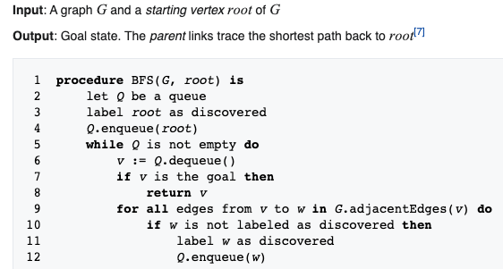

# pathfinding-breadth-first
Simple implementation of breadth first pathfinding algorithm
# breadth first
https://en.wikipedia.org/wiki/Breadth-first_search
# pseudocode

# running the pathfinder
To run the pathfinder run the breadthfirst/BFPathfinder.py file

- create maze

- press ENTER to export grid
- pathfinding result

- you can also inspect the moves that were made (including starting and ending pos)

# YouTube
https://www.youtube.com/watch?v=b-f-42zNtdA

# ENJOY